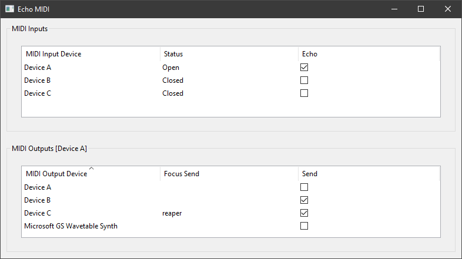

- [EchoMIDI](#echomidi)
  - [Application Overview](#application-overview)
  - [MIDI Inputs](#midi-inputs)
  - [MIDI Outputs](#midi-outputs)
  - [Library](#library)
  - [Building](#building)
  - [Support](#support)
  - [External Libraries Used](#external-libraries-used)

# EchoMIDI

EchoMIDI is a program + library that copies the output of a midi device into multiple output devices. This can be used in combinartion with other software, like [loopMIDI](https://www.tobias-erichsen.de/software/loopmidi.html), in order to use a single midi input in multiple audio / midi applications at the same time. In addition, each output target can be muted manually or auto muted (also called FocusSend) depending on which application currently has the keyboard focus.

## Application Overview

> ###### In development

The application provides a graphical interface that implements the EchoMIDI library, allowing one to quickly setup multiple input devices and their output targets.
The graphical user interface can be seen below.



## MIDI Inputs

This section of the interface displays all the avaliable midi input devices on the system. From here the user can control which input devices will *"echo"* their output.  
Also allows the user to select which inputs device output targets are currently being modified. This is done by **double clicking** the wanted input device row.

### MIDI Input Device

Displays the name of the input device.

### Status

Displays the current state of the input device, in relation to the application. If any exceptions occur relating to a specific input device, the content of this column will be a small error message, explaining the problem with the input device.  
All error statuses will be prepended with `[ERR]`.

### Echo

`Editable`  
If a checkbox is set to on, the input device will be opened and will start to echo its output to the appropiate output devices (*see [MIDI Outputs - send](#send)* for more details).  
An input device is only able to echo its output if it is not already opened by another program. If this is not the case, an `[ERR]` status will occur. To resolve this, simply close the program currently using the wanted midi input device.  
In the figure above, Device A has echoing enabled, whereas Device B and Device C both have them disabled. We can also see that Device A had no problem enabeling echoing, as its current status is `Open`.

## MIDI Outputs

This section of the interface displays all the avaliable midi output devices on the system. The active input device name is displayed in brackets `[]` next to the frame title. The active device can be changed by **double clicking** on the wanted device's row in the MIDI Inputs section.  
Each property in this section is specific to the active device, and will not carry over when it is changed.

### MIDI Output Device

The name of the midi output device.

### Focus Send

`Editable`  
The user can use the focus send functionality by setting this value. By default it is empty, which leads to the device always being unmuted, unless send is off. An executable name, or executable file (both with and without path is valid) can be inserted into this property, which leads to the midi input only echoing into this target, if the currently focused application is equal to the passed executable. Otherwise, no data will be echoed to this target.  
In this case, Device C will only recieve midi data from Device A, if the currently focused program is `reaper`, whereas Device B will recieve midi data no matter what, as its focus send property is empty.

### Send

`Editable`  
If on, the output device will recieve echoed data from the active input device, otherwise it is ignored.  
In the figure, Device B and Device C both have send on. This leads to them both potentially recieving midi data from the active midi input, which is Device A in this case.

#

## Library

### Overview

Generally, each program using the EchoMIDI library should call EchoMIDIInit() before any Echoer::start() method is called, ideally before any other EchoMIDI function, and should call EchoMIDICleanup() when the EchoMIDI library features are no longer needed.

Each input MIDI device that needs to duplicate (or echo) its output, is associated with an Echoer instance. On construction, it needs a MIDI device id, which you can manually determine, or find by using the getMidiInIDByName() method. After construction, the output targets are added with the add() method and removed with the remove() method. Finally, an Echoer instance only echoes its associated MIDI devices output, if it has been started using the start() method.

Additional documentation can be generated by building the ALL target or the EchoMIDI_DOCS target, see [Building](#building).

### Exceptions

If at any point an error occurs in the library code, an MIDIEchoExcept will be thrown. Additional sub exception types exists for more specific error types. The exceptions might be nested.

#

## Building

EchoMIDI Uses CMake as its build system. It exposes the following options and targets.

```
EchoMIDI                      (LIBRARY TARGET)  
EchoMIDIApp                   (EXECUTABLE TARGET)  
EchoMIDI_GEN_DOCS             (OPTION ON/OFF)  
```

`EchoMIDI_GEN_DOCS`
Creates the `EchoMIDI_DOCS` target, which generates an HTML documentation, using Doxygen. It is also generated when building the `ALL_BUILD` target.
The documentation is placed in the binary directory under the docs folder.

This requires Doxygen to be installed.

#

## Support

This is a Windows only library + application. It has been build and tested on Windows 10 using VS 2022.
  
## External Libraries Used

- [wxWidgets](https://github.com/wxWidgets/wxWidgets) for the user interface
- [JSON for Modern C++](https://github.com/nlohmann/json) for reading + writing json files
- [winmm](https://docs.microsoft.com/en-us/windows-hardware/drivers/audio/midi-and-directmusic-components) (local windows library) used for recieving and sending midi sinals
